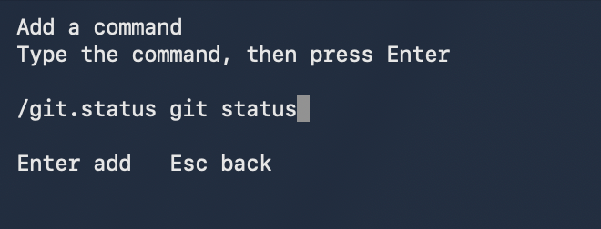
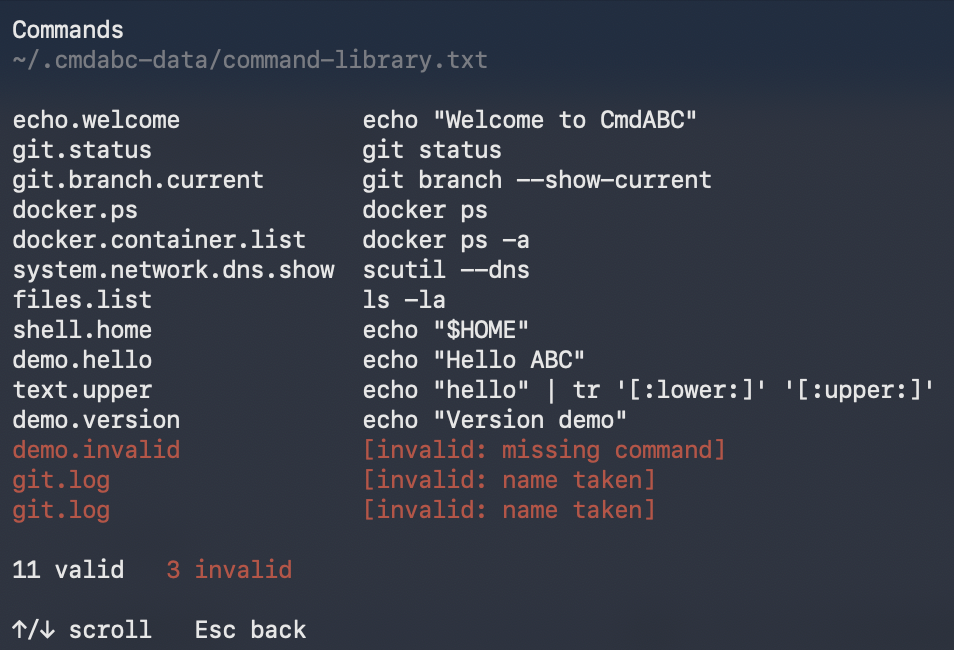

# CmdABC

CmdABC is a lightweight command library and picker for Bash and zsh. Install it. Remember `/abc.`.

English | [简体中文](README.zh-CN.md)

## Quick start

Extract the release package and run:

```sh
./install.sh
```

Open a new shell, then type the final `.` yourself:

```text
/abc.
```


Choose `add`, `del`, or `list`. The screen guides you from there.

## Manage commands

`/abc.` opens the management menu:

- `add` — Add a command
- `del` — Remove a command
- `list` — View commands and errors

The Add screen asks for a name, then a command:



List shows saved commands and errors together:



## Use a saved command

If you saved the name `git.status`, type `/git.` to open its command tree. The final `.` must be typed; pasting the whole trigger does not open the picker.


- `↑` / `↓` — move through visible items
- `→` / `Enter` — open a branch or select a command
- `←` — return and collapse a branch
- `Esc` — cancel

Selecting a command fills the shell command line. CmdABC never runs it automatically.


## User data

Your commands live in `~/.cmdabc-data/command-library.txt`. You do not need to edit this file for normal use: use `/abc.` instead. Advanced or bulk edits can be made directly in the file.

Installation, reinstallation, and uninstallation preserve the command library.

### Manual file format

Each saved command uses `name command` on one line:

```text
git.status git status
docker.ps docker ps
```

The name starts after `/` in the picker and ends before the first space. It must contain at least one `.`, as in `a.b`. Do not write the leading `/` in the file. The command is the full shell content after the first space.

A line whose first non-whitespace character is `#` is a comment:

```text
# git.status git status
```

An inline `#` stays part of the command:

```text
demo.echo echo hello # test
```

## Safety and compatibility

CmdABC fills selected commands without executing them. A malformed record does not hide other valid commands; duplicate names are invalid. CmdABC uses no `eval` or `stty`.

Tested environments: macOS with zsh 5.9 or GNU Bash 5.2; Ubuntu and ImmortalWrt with Bash 5.2.

## Install and uninstall

`./install.sh` needs no administrator privileges. It installs program files under `~/.cmdabc/` and prints how to reload an already open shell. A new shell loads the installation automatically.

To uninstall:

```sh
~/.cmdabc/uninstall.sh
```

The installer manages `~/.bashrc` for Bash; it does not modify `~/.bash_profile` or `~/.profile`. If Bash starts as a login shell, your existing configuration must load `~/.bashrc`.

## License

[MIT](LICENSE)
