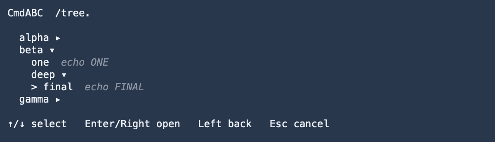
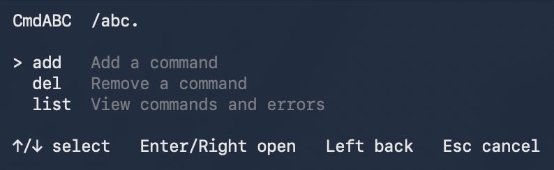

# CmdABC

**Commands as easy as ABC.**

English | [简体中文](README.zh-CN.md)

CmdABC is a lightweight hierarchical command picker and manager for Bash and zsh.

Type a namespace and manually enter the final `.` to open its command tree. Select a leaf to fill the current shell command line — CmdABC never executes it automatically.

## Screenshots

### Command picker



### Built-in management



### Fill, don't execute


### Invalid entries stay isolated


Leaf entries show a dim command preview. Invalid records do not block valid commands; recognizable invalid leaves appear as `???` and report the problem only when selected.

## Installation

Extract the release package and run:

```sh
./install.sh
```

No administrator privileges are required.

Open a new shell after installation. Existing shell sessions keep previously loaded CmdABC functions; the installer also prints how to activate the new installation in the current shell.

Program files:

```text
~/.cmdabc/
```

User command library:

```text
~/.cmdabc-data/command-library.txt
```

Installation and reinstallation leave an existing command library untouched.

## Command picker

Type the namespace, then manually enter the final dot:

```text
/namespace.
```

> Pasting the whole `/namespace.` string does not trigger the picker. The final `.` must be typed.

Controls:

- `↑` / `↓` — move through visible items
- `→` / `Enter` — expand a parent or select a leaf
- `←` — return to the parent and collapse
- `Esc` — cancel

## Managing commands

CmdABC reserves the `/abc.*` namespace for built-in management:

```text
/abc.add.<target> <command>
/abc.del.<target>
/abc.help
/abc.list
/abc.update.<target> <command>
```

### Adding a command

Use `/abc.add.<target> <command>` to add a command to your library.

For example:

```text
/abc.add.git.status git status
```

This creates the target `git.status` with the command:

```text
git status
```

After adding it, type:

```text
/git.
```

and select `status` from the picker.

CmdABC fills `git status` into the current command line but does not execute it automatically.

Dots in the target create namespace levels. For example:

```text
/abc.add.docker.container.list docker ps -a
```

creates:

```text
docker
└── container
    └── list
```

### Command library

User commands are stored in:

```text
~/.cmdabc-data/command-library.txt
```

Each command occupies one line:

```text
<target> <command>
```

For example:

```text
git.status git status
docker.container.list docker ps -a
system.disk df -h
```

The target defines where the command appears in the CmdABC namespace tree, and the remaining content is the command associated with that target.

Using `/abc.add` is recommended instead of editing the library manually.

`/abc.list` can still show valid commands when individual library entries are malformed. Write operations remain strict to avoid rewriting damaged user data.

## Uninstallation

Run:

```sh
~/.cmdabc/uninstall.sh
```

CmdABC removes its program files and managed shell configuration while preserving:

```text
~/.cmdabc-data/
```

A later reinstall will continue using the same command library.

## Tested environments

- macOS — zsh 5.9
- macOS — GNU Bash 5.2
- Ubuntu — Bash 5.2
- ImmortalWrt — Bash 5.2

### macOS Bash note

The installer manages `~/.bashrc` only. It does not modify `~/.bash_profile` or `~/.profile`. If Bash starts as a login shell, your existing configuration must load `~/.bashrc`.

## License

[MIT](LICENSE)
